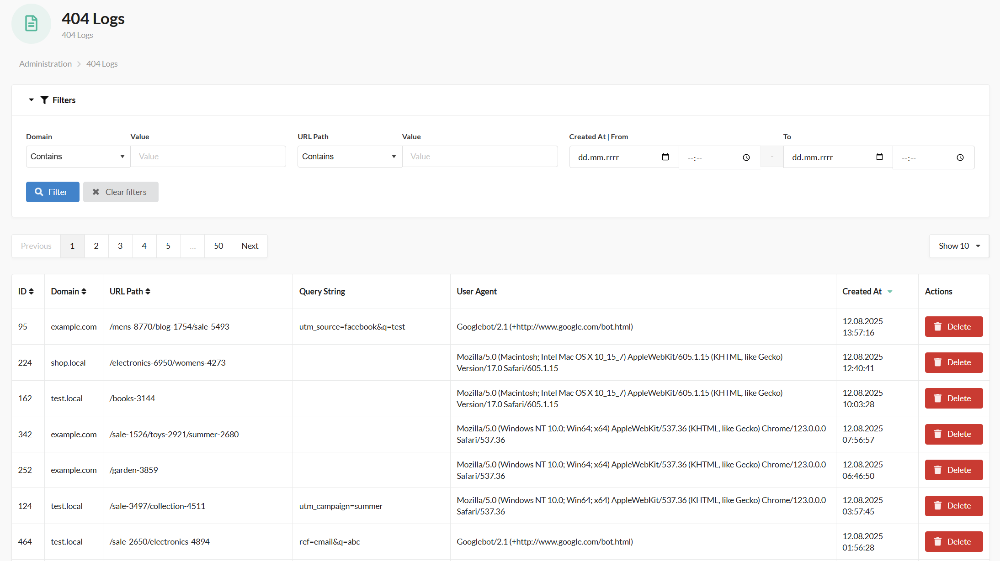
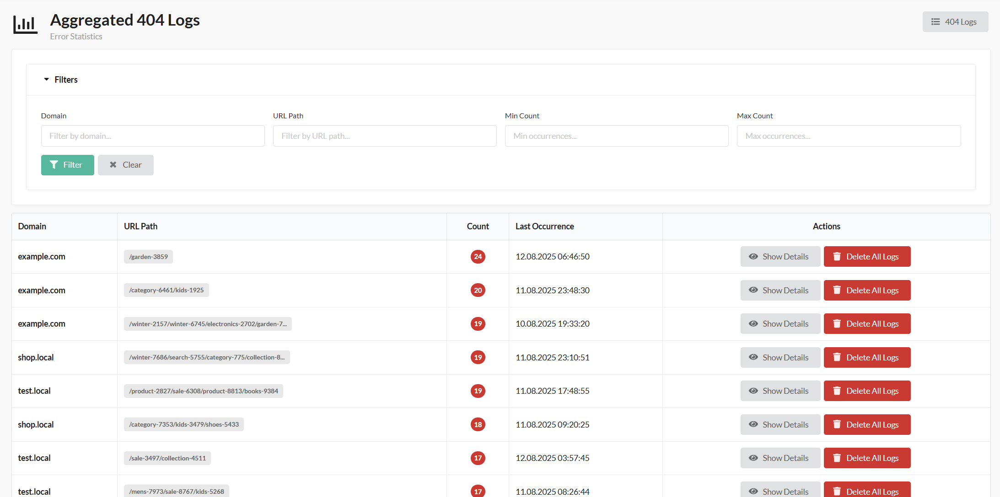
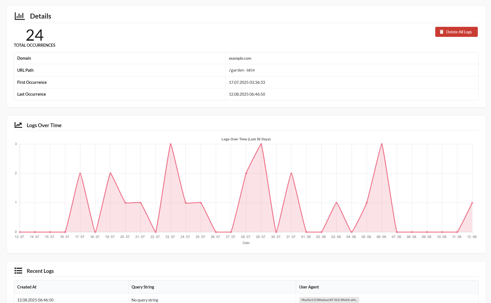

<p align="center">
    <a href="https://www.3brs.com" target="_blank">
        
    </a>
</p>
<h1 align="center">
404 Log Plugin
<br />
    <a href="https://packagist.org/packages/3brs/sylius-404-log-plugin" title="License" target="_blank">
        
    </a>
    <a href="https://packagist.org/packages/3brs/sylius-404-log-plugin" title="Version" target="_blank">
        
    </a>
    <a href="https://circleci.com/gh/3BRS/sylius-404-log-plugin" title="Build status" target="_blank">
        
    </a>
</h1>

## Features

* **404 Error Logging** - Automatically logs all 404 errors with detailed information
* **Smart Filtering** - Configurable patterns to skip logging for admin, API, and static files
* **Aggregated View** - Groups identical URLs with occurrence count and timestamps
* **Detailed Analytics** - View statistics, trends, and individual log entries
* **Multi-language Support** - Available in 8 languages (EN, CS, SK, PL, DE, FR, IT, ES)
* **Admin Integration** - Seamless integration into Sylius admin panel

## Screenshots

The plugin adds a new "404 Logs" section to your Sylius admin panel where you can:

- See detailed information for each URL


- View aggregated 404 errors with occurrence counts
- Delete logs for specific URLs
- Filter by domain, URL path, and occurrence count


- View error statistics and trends


## Installation

1. Run `composer require 3brs/sylius-404-log-plugin`.
2. Register `\ThreeBRS\Sylius404LogPlugin\ThreeBRSSylius404LogPlugin` in your Kernel. 
3. Import the plugin configuration in your `config/packages/_sylius.yaml`:
   ```yaml
       - { resource: "@ThreeBRSSylius404LogPlugin/Resources/config/config.yaml" }
   ```
4. Import the plugin routes in your `config/routes.yaml`:
   ```yaml
   three_brs_sylius_404_log_plugin:
       resource: "@ThreeBRSSylius404LogPlugin/Resources/config/routes.yaml"
   ```
5. Create and run doctrine database migrations:
   ```bash
   bin/console doctrine:migrations:diff
   bin/console doctrine:migrations:migrate
   ```

## Configuration

### Skip Patterns

By default, the plugin skips logging for certain URL patterns to avoid noise. You can customize this behavior in your `config/services.yaml`:

```yaml
parameters:
    # Override default skip patterns
    three_brs_sylius_404_log_plugin.skip_patterns:
        - '/admin'        # Admin section
        - '/api'          # API endpoints
        - '/_'            # Symfony profiler
```

**Disable filtering (log everything):**
```yaml
parameters:
    three_brs_sylius_404_log_plugin.skip_patterns: []
```

## Supported Languages

The plugin includes translations for:
- 🇬🇧 English (en)
- 🇨🇿 Czech (cs)
- 🇸🇰 Slovak (sk)
- 🇵🇱 Polish (pl)
- 🇩🇪 German (de)
- 🇫🇷 French (fr)
- 🇮🇹 Italian (it)
- 🇪🇸 Spanish (es)

## Usage

After installation, navigate to your Sylius admin panel. You'll find a new "404 Logs" menu item that provides:

1. **Aggregated Log View** - Overview of all unique 404 URLs with occurrence counts
2. **Detailed View** - Individual log entries for each URL
3. **Filtering Options** - Filter by domain, URL path, and occurrence count
4. **Statistics** - Error trends and analytics
5. **Management** - Delete logs for specific URLs

## Development

### Usage

- Create symlink from .env.dist to .env or create your own .env file
- Develop your plugin in `/src`
- See `bin/` for useful commands

### Testing

After your changes you must ensure that the tests are still passing.

```bash
$ composer install
$ bin/console doctrine:schema:create -e test
$ bin/phpstan.sh
$ bin/ecs.sh
```

## Contributing

We welcome contributions! Please feel free to submit pull requests or open issues for bugs and feature requests.

## License

This library is under the MIT license.

## Credits

Developed by [3BRS](https://3brs.com)
